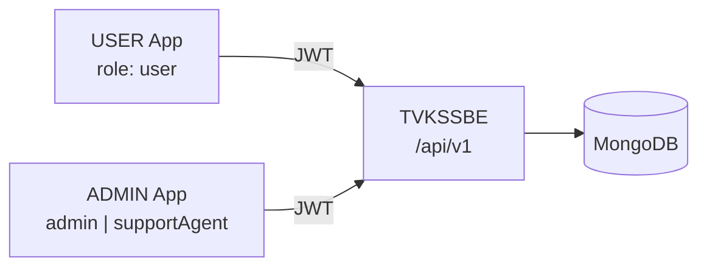
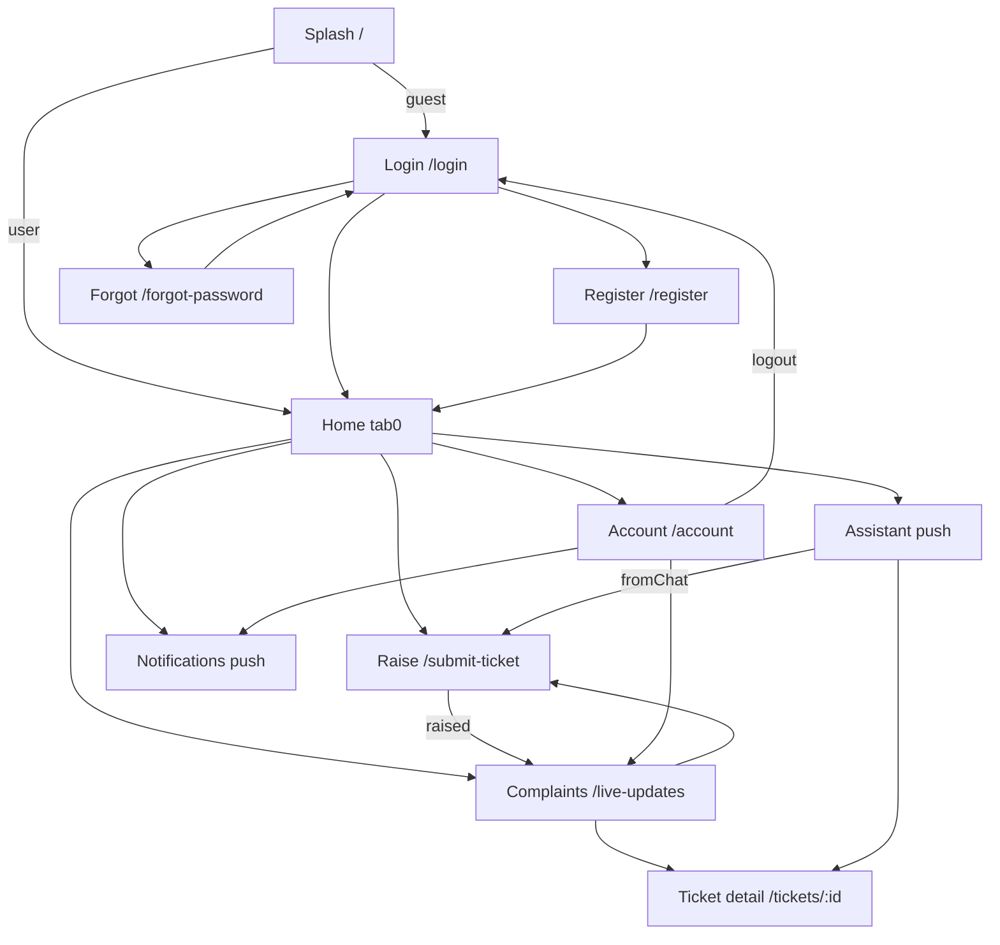
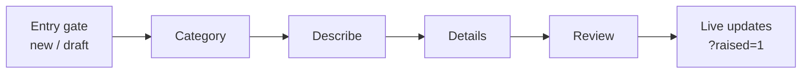
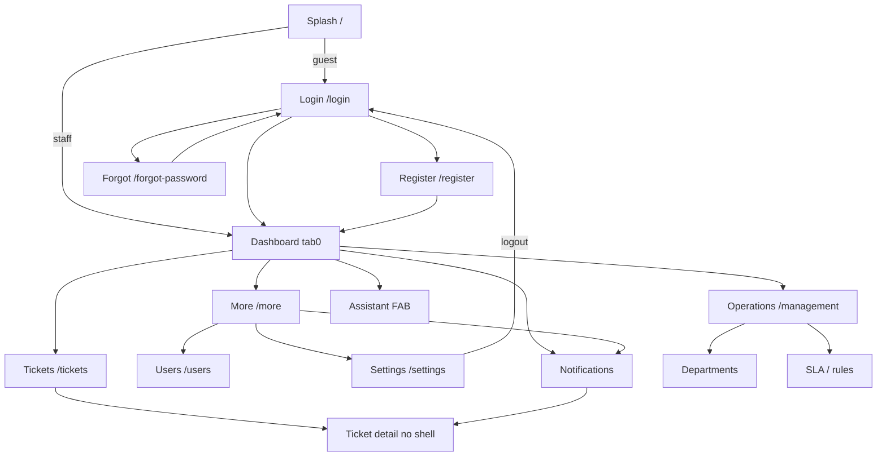
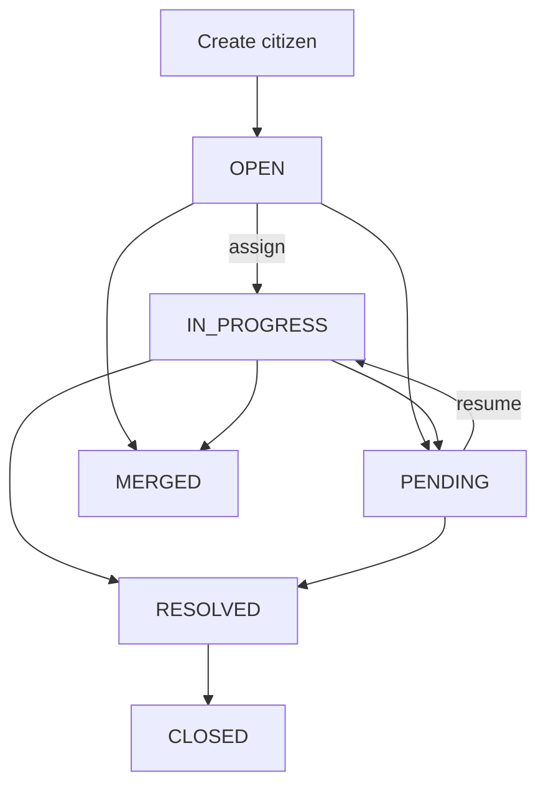

# TVK Full Flow & Page Charts

Generated from USER / ADMIN `go_router` and TVKSSBE `/api/v1`.

## System overview

| Journey | USER | Backend | ADMIN |
|---------|------|---------|-------|
| Auth | Login / Register / Forgot | JWT + reset OTP | Staff login / register |
| Raise complaint | Submit wizard → My complaints | POST /tickets → OPEN | Tickets board |
| Track & update | Live updates + detail | Comments / status / SLA | Assign, status, merge |
| Assistant | FAB chat → draft ticket | POST /assistant/chat | FAB staff assistant |
| Ops config | — | Departments, SLA, rules | Operations hub + drawer |

---

## USER page flow

### Raise complaint wizard

`fromChat=1` skips the entry gate and opens at Describe (`step=1`).

### USER routes

| Path | Page | Auth |
|------|------|------|
| `/` | Splash | hydrate |
| `/login` | Login | guest |
| `/register` | Register | guest |
| `/forgot-password` | Forgot | guest |
| `/home` | Home | user |
| `/submit-ticket` | Raise | user |
| `/live-updates` | Complaints | user |
| `/tickets/:id` | Detail | user |
| `/account` | Account | user |
| `/assistant` | Assistant | user |
| `/notifications` | Notifications | user |

**Shell tabs:** Home · Raise · Complaints · Account

---

## ADMIN page flow

### Operations children

Departments · Tags · Knowledge base · Escalation · SLA · Auto-assignment · CSAT

### ADMIN routes (selected)

| Path | Notes |
|------|-------|
| `/dashboard` | Stats / charts hub |
| `/tickets` | List + filters |
| `/tickets?overdue=1` | Overdue filter |
| `/overdue` | Redirect → overdue query |
| `/management/*` | Ops CRUD screens |
| `/tickets/:id` | Standalone detail |
| `/users` | Invite + status analysis |

**Shell tabs:** Dashboard · Tickets · Operations · More  
**RBAC:** Router = staff only; Assign UI = admin only

---

## Ticket lifecycle

### Citizen path
1. Raise wizard or Assistant handoff  
2. `POST /tickets` → OPEN (+ auto-assign try)  
3. Track on `/live-updates` + detail comments  
4. Optional CSAT after resolution  

### Staff path
1. Board / dashboard → ticket detail  
2. Assign (admin) forces IN_PROGRESS  
3. Status, notes, merge, SLA / escalation  
4. Resolve / close; citizen sees update  

### API domains

| Domain | Mount | Consumers |
|--------|-------|-----------|
| Auth | `/auth` | USER + ADMIN |
| Tickets | `/tickets` | USER + ADMIN |
| Assistant | `/assistant` | USER + ADMIN |
| Departments | `/departments` | USER read · ADMIN CRUD |
| User management | `/user-management` | ADMIN |
| Locations / SLA / rules | ops mounts | ADMIN |
| Notifications / push | `/notifications` · `/push` | both |
